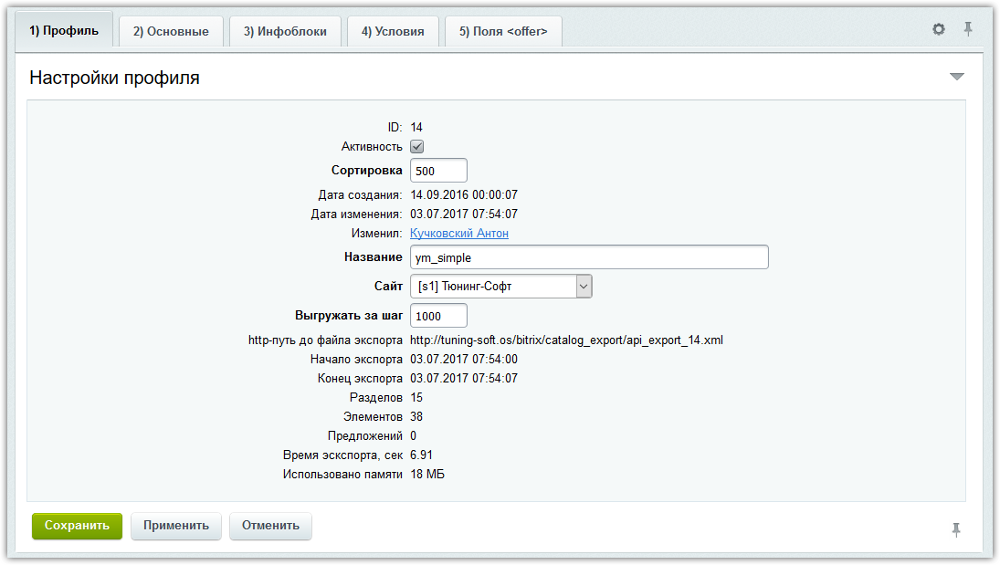
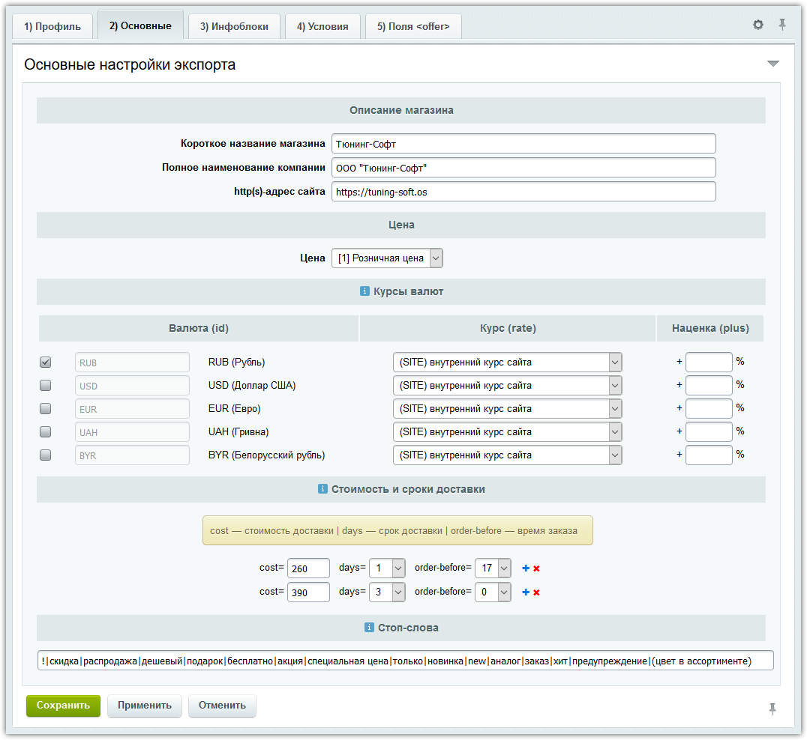
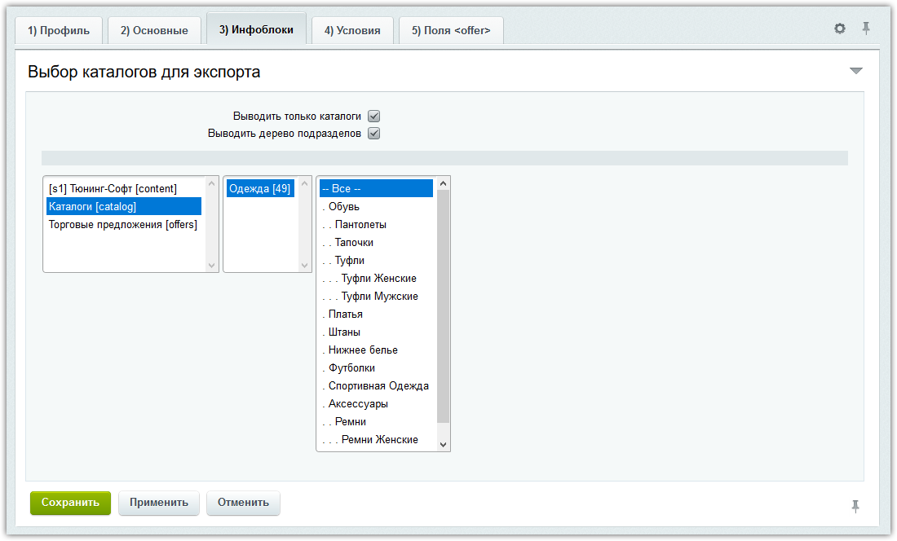
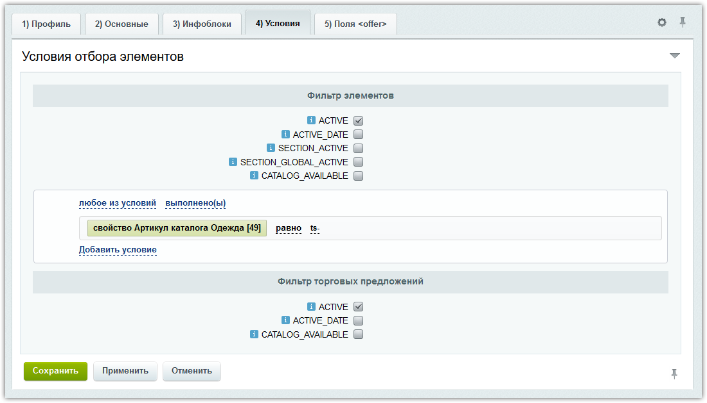
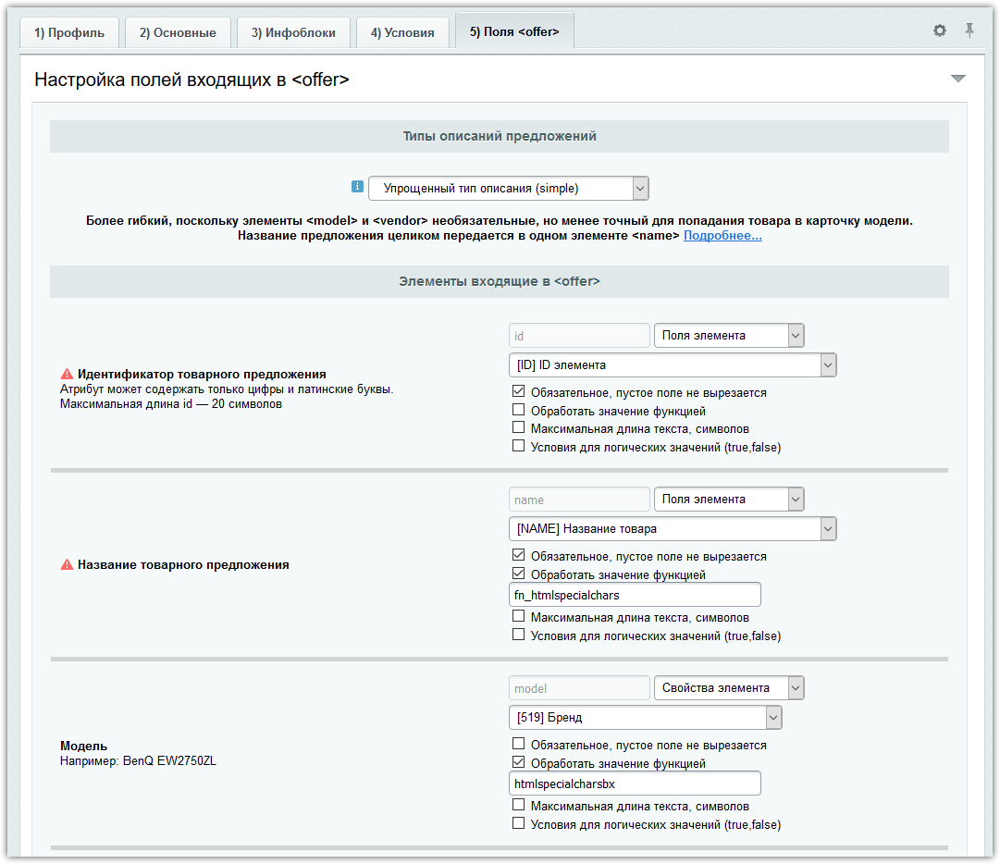

# api.export

## TS Умный экспорт (api.export)

Модуль выгружает товары и торговые предложения с определенной структурой в один xml-файл.

Адрес до xml-файла указывается  в личном кабинете того сервиса, с которым вы работаете, он автоматически его загружает, обрабатывает и публикует товары, с вашей стороны требуется только своевременное обновление xml-файла на своем сайте.

Пока поддерживается три  сервиса:

1) Яндекс.Маркет
- Упрощенный тип описания (simple)
- Произвольный тип описания (vendor.model)

2) Google Merchant
- Обновление онлайн-ассортимента (Online)
- Фид товаров (Products)

3) Яндекс.Дзен
- RSS 2.0

Модуль очень прост для освоения вашим разработчиком, вся обработка экспорта в одном файле, запускается экспорт во втором файле.

